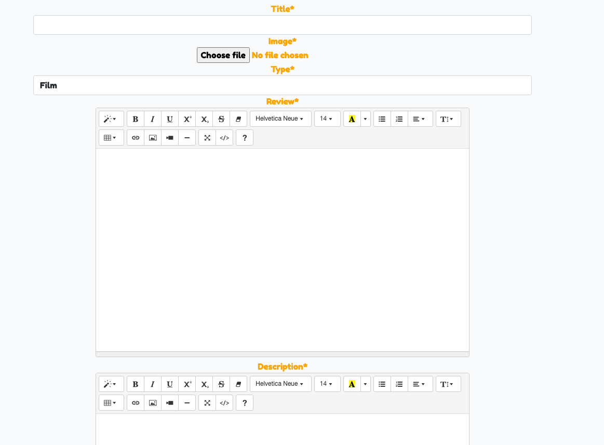
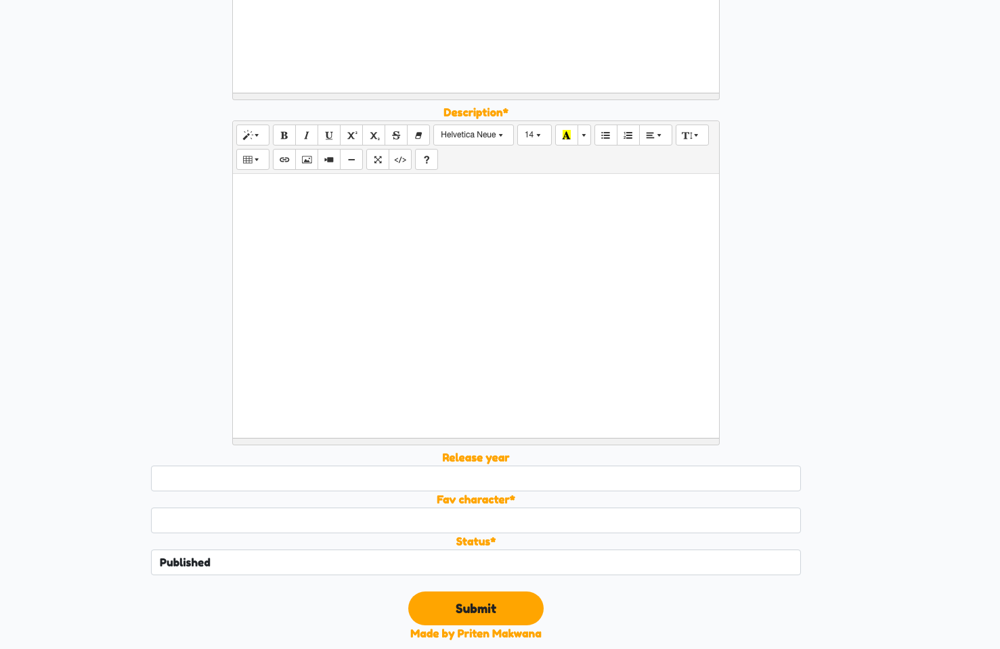

# Contents

[Unfiltered Anime](#unfiltered-anime)

[UX](#ux)
+ [User Stories](#user-stories)
+ [Agile](#agile)
+ [Wireframes](#wireframes)


+ [Existing Features](#existing-features)
    + [Navbar and Footer](#Navbar-and-Footer)
    + [Home Page](#home-page)
    + [Sign Up](#sign-up)
    + [Sign In](#sign-in)
    + [User Login](#user-login)
    + [Admin Login](#admin-login)
    + [User Login](#user-login)
    + [User/Admin AddReview DeleteReview](#user-admin-addreview-deletereview)
    + [User/Admin WatchList](#user-admin-watchlist)
    + [User Review detail - user or non user](#user-review-detail-user-or-non-user)
    + [User Review detail - user on own post or admin on all](#User-review-detail-user-on-own-post-or-admin-on-all)


[Future Features](#future-features)
+ [Reporting app](#Reporting-app)
+ [Timesheet app](#Timesheet-app)
+ [SMS communication app](#SMS-communication-app)
+ [Employer app](#Employer-app)
+ [Traffic app further development](#Traffic-app-further-development)

[Technologies Used](#technologies-used)
+ [Languages Used](#languages-used)
+ [Frameworks, Libraries & Programs Used](#frameworks-libraries-and-programs-used)

[Code Validation](#code-validation)
+ [HTML beautify](#HTML-beautify)
+ [HTML valiation](#HTML-valiation)
+ [CSS validation](#CSS-validation)
+ [JavaScript validation](#JavaScript-validation)
+ [Python beautify](#Python-beautify)
+ [Python validator](#Python-validator)

[Tests](#tests)
+ [Automated Tests](#automated-tests)
+ [Lighthouse](#Lighthouse)
+ [Manual tests](#Manual-tests)

[Project Bugs and Solutions](#project-bugs-and-solutions)
+ [Link to Google Maps](#link-to-google-maps)
+ [Static files not loading](#static-files-not-loading)
+ [Styling map template](#styling-map-template)
+ [Hero image styling](#hero-image-styling)
+ [Road cleared in traffic alerts](#road-cleared-in-traffic-alerts)
+ [UK postcode search](#uk-postcode-search)
+ [Navbar Current Link](#navbar-current-link)
+ [New traffic alert](#new-traffic-alert)
+ [Journey form errors](#journey-form-errors)
+ [Geocoordinates](#geocoordinates)
+ [Postcode extraction](#postcode-extraction)
+ [Edit_journey](#edit_journey)
+ [Traffic_msg_list pagination](#Traffic_msg_list-pagination)
+ [Pre-populated Journey Form](#pre-populated-journey-form)
+ [Button descendant of anchor](#button-descendant-of-anchor)
+ [Source code](#source-code)
+ [Form Fields Styling](#form-fields-styling)
+ [Bugs left](#Bugs-left)


[Deployment and making a clone](#Deployment-and-making-a-clone)
+ [Deployment to heroku](#Deployment-to-heroku)
+ [Forking the GitHub Respository](#forking-the-github-repository)
+ [Making a Local Clone](#making-a-local-clone)
+ [Setting up your local enviroment](#Setting-up-your-local-enviroment)


[Credits](#credits)
+ [Online resources](#Online-resources)
+ [Tutorials and inspiration](#Tutorials-and-inspiration)
+ [People](#People)

# Unfiltered Anime

[](https://unfiltered-anime.herokuapp.com/)

Live Site: [Click Here](https://unfiltered-anime.herokuapp.com/)
Github: [Click Here](https://github.com/PritenMakwana44/unfiltered-anime)

The purpose of this website is to allow users to write reviews on their favourite Anime. The website then allows other users to read the reviews, comment on reviews and add to the reviews to their Watch List so they can watch their new favourite anime film/show later.

The Ultimate goal is to bring Anime fans togther, share their passion of Anime and find new Anime.

## UX
------

### User Stories
Github was used to manage User stories and bugs.

#### User stories

1. USER STORY: View Review list
    - Review List is on home page for users to see all Reviews.
    - If you click a review in the review list it opens up the review.

2. USER STORY: Create Review
    - There is a Create review button for any user to create Anime reviews.
    - User must have account created to create a review.
    - Once review is created it's shown on the Review list.
3. USER STORY: Delete Review
    - User can delete their own Reviews using a button.
    - Button does not show unless user is creator of the review.
4. USER STORY: Edit Review
    - User can edit their own Reviews using a button.
    - Button does not show unless user is creator of the review.
5. USER STORY: Upvote/downvote review
    - User can upvote or downvote any post
    - Upvotes and downvotes numbers are shown in Review list. 
    - One can not upvote and downvote the same post.
6. USER STORY: Account Registration
    - User must register an account.
    - User gets access to many diffrent functions once registered such as adding reviews,comments and reviews to their review list.
    - A user can login or logout as they please.
    - A user can create as many accounts as they want.
7. USER STORY: Comment On Review
    - Users can Comment on any Review including their own.
    - Function is used to create a feel of community. 
8. USER STORY: View Comments
    - Users can view anyones comments on any post.
9. USER STORY: View upvote/downvotes
    - Users can see number of Upvotes and downvotes on each review.
10. USER STORY: Site pagitnation
    - If user reaches 10 reviews on a page, they will then have pagitnation acitive which then gives them a next page button.
11. USER STORY: Add review to watch later
    - If user is logged in they can add any review to their Watch later list via a button.
12. USER STORY: Watch later section view
    - If user is logged in they get an extra tab on their Navigation bar called Watch later.
    - The watch later button leads them to see all Anime reviews on another page.
13. USER STORY: Manage Reviews
    - If User is an admin then they can manage reviews via admin panel or certain features on webiste.
    - They can delete or edit any review via public site or admin panel.
14. USER STORY: Manage comments
    - If User is an admin then they can manage comments via admin panel or limited features on website.
    - They can delete any comment via either admin panel or site. 
    - Future functionality will allow them to approve or disapprove any comment as all comments require authorisation.
15. User Story: 404 error
    - Future feature will have a 404 error website which allows them to navigate to the real site.

### Agile


Github issues was used to create the User stories. 
Can find my Github issues here: [Cick Here](https://github.com/users/PritenMakwana44/projects/4/views/1).
The sections are split into Todo, Inprogress, End user function done, Admin function done and future.


## Wireframes 

I used Balsamiq to create my wireframes. I based my designs on a desktop site first then made them responsive after built.

### Main Page
The main page is my home page for the review site.


### Sign-Up Page: 
This is the page for users to sign up.


### Sign-In Page:
This is the page for users to sign in.


### User logged-in Home Page:
Once the user logs in the nav bar changes. Here is the view.


### Admin logged-in Home Page:
Once the admin logs in the nav bar changes. Here is the view.


### User/Admin WatchList Page:
This is the view for the WatchList.


### User Review detail user or non user Page:
When the user or non logged in user clicks on a post this is the detail page.


### User Review detail user on own post or admin on all Page:
This is what the page would look like when admin or user is logged in.


## Existing Features
------

### Navbar
For anyone who comes into the site this is the default navbar. The navbar includes a sign in and sign out function.


### Review detail
Here is the view when you click on a post when your not logged in.


### Sign In
Here is the sign in page.


### Sign Up
Here is the sign up page.


### Sign Out
Here is the sign out page.


### Log in Alert.
Here is what the alert looks like when you log in. 


### User Nav
Here is what the Nav bar looks like when your logged in.


### Review List
Here is the list of reviews on the home page under the navbar.


### Add Review
Here is what it looks like for a logged in user to add a review. Only logged in users can do this.




### Watch Later List
Each review has a add to watch list button for a logged in user. This adds the review to the watch later list. There is a remove from watch later button each review. It removes the review from the watch later list. Users also are able to open the review by clicking the post too. 


### Review detail admin/user own
If an admin logs in they get the option in the review post itself to edit or delete a review. If a user is logged in then they can edit or delete their own post only.


### Upvote/Downvote
If a user is logged in then they can either upvote or downvote. They can't do both.


### Comments
Here is what the comments section looks like for any logged in user. If you comment on a post as a user it then gets sent to the admin for authorisation.


### Comments as an admin
Here is what the comments section looks like as an admin. The extra feature is that admin can delete any comment from any user as feature to make sure all comments are appropriate.


### Comment approval
Here is where the admin can approve comments. This is in the admin panel.


### Footer
The footer has been kept basic just my trademark as for who created the site.


### Login as admim
If an admin is logged in. They get access to a diffrent nav bar with access to the admin panel.


### Admin center
Here is where the admin can make any changes they would like within the admin panel.


## Technologies Used
------

### Languages Used

   + HTML5
   + CSS3
   + JavaScript
   + jQuery
   + Python
   + Django

### Technologies and Programs Used:
+ GitHub
    The Git was used for version control
    Git issues were used for user stories
    GitPod was used as IDE to write the code and push to GitHub
+ Heroku 
    The page was initially deployed to Heroku
+ Railway App
    The page was removed from Heroku and move to Railway
+ PostgreSQL
    PostgreSQL was used as database for this project
+ VSCode
    VSCode was used on the days when GitPod was down
+ Google Cloud
    to get api key
+ cloudinary storage
    for storing static files (later removed)
+ whitenoise
    for soring static files to replace cloudinary

 ### Frameworks Libraries and Programs Used

+ Balsamiq:
    Balsamiq was used to create the wireframes during the design process.
+ Bootstrap 5:
    Bootstrap was used to add style to the website.
+ Bootswach:
    Bootswatch was added to change the standard styling and color pallette provided by bootstrap
+ Bootstrap icons
+ Django 3.2

## Code Validation
------

### HTML beautify

I started tidying up HTML code by searching for a beautifyier for HTML code. I tired [JS Beautifier](https://marketplace.visualstudio.com/items?itemName=HookyQR.beautify) and [Prettier](https://marketplace.visualstudio.com/items?itemName=esbenp.prettier-vscode) in VS code - both have edited django templating tags in the way they were no longer working. They were also splitting the attributes of html elements to seperate lines. This was visualy helpfull with some tags with wide variety of attributes, but for most tags it was confusing. In the end I used [online HTML code Beautifier](https://htmlbeautify.com/). It has visualy fixed issues with incorrect indentation inherited from copying from various sources. 

### HTML valiation

I have right clicked on the rendered page and copied the code of each page into [HTML validator](https://validator.w3.org/nu/#textarea)


| Page  |  result
| ------ | ------ |
|  [Index](README_docs/HTML-validator/HTML-validator-01-index.pdf) |  No errors |
|  [Date pickeer](README_docs/HTML-validator/HTML-validator-02-date-picker.pdf)|No errors|
|  [Drive](README_docs/HTML-validator/HTML-validator-03-drive.pdf) |No errors|
|  [Day Report](README_docs/HTML-validator/HTML-validator-04-day-report.pdf) |No errors|
|  [New Traffic Alert](README_docs/HTML-validator/HTML-validator-05-new-traffic-alert.pdf) |No errors|
|  [Login](README_docs/HTML-validator/HTML-validator-06-users-login.pdf) |No errors|
|  [Register](README_docs/HTML-validator/HTML-validator-06-users-register.pdf) |No errors|
|  [User Profile](README_docs/HTML-validator/HTML-validator-07-users-profile.pdf) |No errors|


### CSS validation

No errors were found when passing through the official [W3C validator](https://jigsaw.w3.org/css-validator/). The copy of the CSS report can be found [here](README_docs/CSS-validator.pdf)

### JavaScript validation
Javascript code validation was complited on [jshint](https://jshint.com/)
Initialy it was returning errors in relation of ES6 syntax, which was resolved by adding this line to the beggining of the file
```
/*jshint esversion: 6*/
```

| Page  |  result
| ------ | ------ |
|  [Google Places](README_docs/JSHint-google-places.pdf) |  two warnings |
|  [User Profile](README_docs/JSHint-user-profile.pdf) |  two warnings |


Unfortunately it has been also returning errors connected with the use of JQuery, which I have not managed to resolve. It claims I have 3 undefined variables '$', 'google-api-key', 'google'.


I have left two warnings in the code, which do not seem to have affected the working of the code
```
252	Functions declared within loops referencing an outer scoped variable may lead to confusing semantics. (google, $, lat_id, long_id)
248	The body of a for in should be wrapped in an if statement to filter unwanted properties from the prototype.
```

### Python beautify
All pages were initialy put through [Python Formatter](https://codebeautify.org/python-formatter-beautifier) which automaticaly sorted most of the too long lines errors. Than the code was checked by pylint and problems were displayed in the console. Once the issues were cleared I have put all code though pep8 validator.

### Python validator

The PEP8 style rules were followed with exceptions specified in the files setup.cfg and .pylintrc. Those files were used to custom configure python validation.
More about .pylintrc can be found [here](https://www.getcodeflow.com/pylint-configuration.html) and about setup.cfg can be found [here](https://pep8.readthedocs.io/en/release-1.7.x/intro.html#configuration)

| App name  |  file name | result |
| ------ | ------ |------ |
| mileage-tracker |  urls.py |  [all ok](README_docs/pep8-validator/01-mileage-tracker-urls.txt) |
| traffic |  admin.py |  [all ok](README_docs/pep8-validator/02-traffic-admin.txt) |
| traffic |  forms.py |  [all ok](README_docs/pep8-validator/02-traffic-forms.txt) |
| traffic |  models.py |  [all ok](README_docs/pep8-validator/02-traffic-models.txt) |
| traffic |  urls.py |  [all ok](README_docs/pep8-validator/02-traffic-urls.txt) |
| traffic |  views.py |  [all ok](README_docs/pep8-validator/02-traffic-views.txt) |
| users |  admin.py |  [all ok](README_docs/pep8-validator/03-users-admin.txt) |
| users |  forms.py |  [all ok](README_docs/pep8-validator/03-users-forms.txt) |
| users |  models.py |  [all ok](README_docs/pep8-validator/03-users-models.txt) |
| users |  urls.py |  [all ok](README_docs/pep8-validator/03-users-urls.txt) |
| users |  views.py |  [all ok](README_docs/pep8-validator/03-users-views.txt) |
| visits |  admin.py |  [all ok](README_docs/pep8-validator/04-visits-admin.txt) |
| visits |  forms.py |  [all ok](README_docs/pep8-validator/04-visits-forms.txt) |
| visits |  mixins.py |  [all ok](README_docs/pep8-validator/04-visits-mixins.txt) |
| visits |  models.py |  [all ok](README_docs/pep8-validator/04-visits-models.txt) |
| visits |  urls.py |  [all ok](README_docs/pep8-validator/04-visits-urls.txt) |
| visits |  views.py |  [all ok](README_docs/pep8-validator/04-visits-views.txt) |

## Tests
------

### Automated tests

Automated tests have not been created due to time constrains of the project.

### Lighthouse


The Lighthouse in Chrome dev tools has been run. The results indicated very positive outcome of testing Accessibility, Best Practice and SEO, unfortunately the Performance has been assesed very low.  


It seems that perfo is hindered by the fact I have all bootstrap files in cludinary. I would normaly use cdn link provided by bootstrap. In the case of this project I used bootstwatch. This ment that I had to download all css files that bootstrap is made off and replace the main bootstrap.css with the one that is provide by bootstwatch. 

Another hiderance in performance must have been heroku - as a free user I am provided with much slower performance than commercial websites. 

The images were compressed - using [tiny.png](https://tinypng.com/) to prevent any issues.

### Manual tests

#### 1. First set of manual testing on Version 1 (branch Visits)

**Relese main fetures:**

* users app - user was able to register and log in
* traffic app - user was able to add traffic alerts
* visits app - drive view: user was able to type in start and destination address, than he was automaticaly transfered to map pre view, where user could add the entry to database and click the link to go to google maps.

**Reported issues:**

  * Initial version did not have submit button, but the form has been submitted automaticaly after the user chose the destination address from dropdown box, this was assessed negatively, as the user likes to have control over when he goes to the next page. 

  I have added the button to submit the addresses

  * Initial version requred user to submit data on the address input form, than submit data on the map page. Users complained that the process is very complicated and, when user was observed interacting with the page, it became obvious that he is lost as to what to do on the Map page. 

  I have dropped the Map page and I have the one button fetching data from google directions and submitting to the database in one go. I also thought that javascript google map is not of any value to mobile phone user, as he can't use it to drive. User needs a button to click and be transfered to google maps and use it as Sat Nav. 

  User was unaware that he had the option to click into the link and be transfered to google maps. The link was white letters on dark background and didn't stand out. 

  I have added a google maps icon with geocoordinates for user to click so he can intuitivly use this option. 

  * Initial testing have revealed that google places drop down sometimes doesn't apear. It might have been caused by [Dark Raider](https://chrome.google.com/webstore/detail/dark-reader/eimadpbcbfnmbkopoojfekhnkhdbieeh/related?hl=en) chrome extension, although further tests have excluded this. 

  I have added javascript validation on input that guides the user through helpfull messages 
  - Please click into the drop down field to choose the correct address
  - This field is required
  - We have found geocoordinates
  Positive message is in green, negative are in red.

  Should the user still decide to submit the form with the red errors he gets a long message from django form validation that is customised, depending on error type. 

  * Users also noticed that new traffic alerts aren't showing on the traffic alerts list. 

  I have found the error in the code, new messages were submitted as "draft" not "published" therefore they were not shown on the list. I have made all new traffic alerts created with the status "published"

  * Users pointed out that the "month" button in nav bar isn't working

  This functionality wasn't ready for the first realease

  * Users appraised the dark theme of the website and the general design. 

  * Users didn't like the fact that nav bar wasn't folding into a button for mobile phone. The fact that the icons were dropping down in un organized way was particulary distracting. 

  Since this app is directed for mobile phone users mainly I have build special dedicated nav bar for mobile only. I have used media query to show and hyde the nav bars appropriately.

#### 2. Set of tests Version 2 (new-drive branch)

**Main features:**

* Rebuild the drive view with drive button and removed map view.
* Added nav bar for mobile phones

**Reported issues:**

* user spotted error in the link in the button that is supposed to take him to the destination address on google maps. There was no coordinates in the link.

I've noticed that this link has variables that were in previous release, updated variables to up to dates, geocoordinates are now loading correctly.

* user was observed interacting with the app. As soon as he clicked onto the start adress input field, the keyboard showed up and the user started typing the postcode. The user didn't realised that under the keyboard there was a drop down box to click into. 

The user was using particulary small phone - screen witdht 320px

I added autofocus to the start address input element. Hopefuly this will scroll the element automaticaly to the top of the page. 

* footer was covering lots of content of the drive page, fotter was made non sticky as it doesn't contain any vital information that driver would need in every day use.

#### 3. Sets of tests Version 3

**Main features:**
* Added option to edit journey
* Improved footer, to get it to the bottom of each page. 
* Added little description to explain tank incon and road clear icon in the traffic messages lists view.

**Reporeted issues:**

* edit_journey - was adding new journey, instead of editing it - I fixed this error
* footer is no longer covering content, but it floats half way through the page - like in date pickers, still floats on login page.
* user complained that his email is visible when he posts traffic alert - changed this to display first name only.
* drive template, current journey accodreon - when user clicks on the map - the accordeon automaticaly opens and there is too much information for a small mobile to display. Also once the accordeon on orange box current journey opens, the form to add next journey goes down below and user has to scroll. - changed to div. 

On the journeys list down below on the page - the current journey is marked with orange fonts - this way user will see that his journey has been added to the list and he can edit or delete it there

* user raised concern that two arrows up and down are not clear - only after you hover over them it becomes clear - that they reffer to road clear. User pointed out that any driver would see on google maps how is the current traffic situation and google maps will provide most up to date information if the road has cleared or not. Therefor the little icon and voting "road_clear" is irrelevant and confusing for some users. - I removed road clear icon from the traffic_msg_list template and the "road clear" button from the modal as well as view responsible for adding road clear. It seemed to acheve much cleaner look of the card containing the traffic alert. 

* user has expressed his worry - why one of the links on the nav bar have become inactive. This was the nav bar link becoming gray instead of white for the current page. It wasn't very intuitive for the user. I changed this feature so the nav link becomes orange for the current page - both for mobile and for desktop nav bar.

## Project Bugs and Solutions:
------
### Link to Google Maps
I had two issues with link to google maps. First issue is that the link opened with no coordinates. This was resolved after reading the documentation. The second issue is the random results of clicking into this link for desktop computer users. 

When user typed in the start and destination addres and clicked drive, he has the current journey displayed in orange box with an icon of google maps. This icon contains the link. The user should be transferred to google app (on mobile) or google maps website (on desctop computer), unfortunately initialy the google app/website was opening but with no coordinates. The documentation about google maps urls can be found [here](https://developers.google.com/maps/documentation/urls/get-started).

To test the functionality that was described in the documentation I have created a sample url:

```

https://www.google.com/maps/place/47%C2%B035'42.6%22N+122%C2%B019'53.9%22W/@47.5951518,-122.3316393,17z/data=!3m1!4b1!4m5!3m4!1s0x0:0xca3d37fe916595c3!8m2!3d47.5951518!4d-122.3316393

```

This url opens google places and it would require for the user to click directions to be further transfered to google maps and use it as a sat nav. 

I have learned what components the url consists of:
- beggining of the url: `https://www.google.com/maps/dir/?api=1`
- the word origin: `&origin=`
- geocordinates for origin: `latitute%2Clongtitute`
- the word destination: `&destination=`
- geocordinates for destination: `latitute%2Clongtitute`

The words latitude and longitude have to be replaced with variables - so the link is dynamicaly generated for each journey. 

Another working example below takes the user to google directions, but both address start and destination is pre set for the user. This would create confusion for mobile phone users as they want to use the google maps as a sat nav.
```
https://www.google.com/maps/dir/?api=1&origin=51.8630529%2C0.1755065&destination=52.5000791%2C-0.7110285
```

The final version of the url contains only destination geocoordinates. This works exactly as planned for mobile phone - the user gets transfered to google maps with the destination pre-filled, while the start address google maps fetches from user's location. The user can immediately use google maps as sat nav. 
```

https://www.google.com/maps/dir/52.5000892,-0.7110479/52.3970259,-0.7309219/@52.4478939,-0.7700209,12z/data=!3m1!4b1!4m4!4m3!1m1!4e1!1m0
```
The link might behive in unpredictable way for desktop computer users. The google directions will try to obtain the user's location - if the user enabled location the app might get his actual location, otherwise it can get start address from unknown source or historic data. This was pointed out by one of the testers. I was unable to recreate this issue on my computer as it is clearly set to see my current location. For desktop computer users - the link should be changed to fetch both start and destination address and display the whole journey for the user. 

The app was not designed or tested for other apps that can be used as sat nav for mobile phone as google maps is most popular app, widely used. 

### Static files not loading
I deployed page to heroku. Page was displaying white without any css or js files loaded. 


The below error was displaying on console:


Tried several solutions:

Not worked:

- import mimetypes - solution found [here](https://stackoverflow.com/questions/35557129/css-not-loading-wrong-mime-type-django) 
- changes to file path in settings and / or in base.html file, which was suggested in one of the answeres [here](https://stackoverflow.com/questions/48248832/stylesheet-not-loaded-because-of-mime-type)

- assumption that the problem is caused by CSS library starting with comments - solution found [here](https://stackoverflow.com/questions/48248832/stylesheet-not-loaded-because-of-mime-type)

Worked:

- change `DEBUG = False` - solution found [here](https://stackoverflow.com/questions/35557129/css-not-loading-wrong-mime-type-django).

- make DEBUG variable dependable on development variable. If app can find development variable in enviroment - it sets the debug to the value of the variable, if no development variable found - the debug goes to False as default. Solution proposed in [this](https://learn.codeinstitute.net/courses/course-v1:CodeInstitute+FST101+2021_T1/courseware/dc049b343a9b474f8d75822c5fda1582/00bc94313a374f519dbec8dfb7ed0fbd/) Code Institute video. 
```
development = os.environ.get('DEVELOPMENT', False)

DEBUG = development

if development:
    ALLOWED_HOSTS = ['localhost', '127.0.0.1', '127.0.0.1:8000']
else:
    ALLOWED_HOSTS = ["tank.up.railway.app"]
```
`os.environ["DEVELOPMENT"] = "True"` variable needs to be added to env.py file, while in heroku - do not add this variable at all. 

### Styling map template

In the first release of the project - the user had a possibility to see a map preview. I had initialy lots of problems to make the javascript map load. The google javascript api map requires special setting on the body and element that will hold the map:
```
#map-route {
height: 100%;
```
After this settings was applied - the map rendered. Unfortunately once the bootstrap css have been added, this setting was not correct for page to render the map. I have tried to add `!important` but this has not worked. I tried all settings that were working from oryginal map-only.css and set them all as `!important` but this has not worked either. I could see on the developer's tools that map's div was rendering, but the div size was 0px hight. I tried various different settings in dev tools in chrome but none gave right scale of the map. I wasn't able to locate which part of bootstrap's styling needs to be overriden.

In the end I decided to style this page similarly as bootstrap looks - same background color and fonts. I have also styled javascript map in night mode to blend into the overall style of the app. 

In the next relese of the app - I decided to drop the map pre-view all together as it was not bringing any value to a mobile phone user and it was forcing the user to do multiple clicks before data was saved and he could input next journey. 

### Hero image styling

The hero was copied from Bootstrap examples as a whole item with all styling already applied by bootstra's classes. I've noticed when testing responsivness on chrome dev tools that hero image on index.html is moving to the left of the screen, doesn't stay in the middle. I have tested in dev tools various different bootstrap classes and different css properties. The solution was adding some more classes in row div to control the number of columns depending on the screen size (`row row-cols-1 row-cols-sm-1 row-cols-md-1 row-cols-lg-2`), while the col divs will have only `col` class. Previously img div had set col width depending on screen size, while text col div had only settings for large screens. They did not seem to add up to 12 as per bootstrap's standard. I copied the classes from dev tools to the template, which has resolved the issue.

### Road cleared in traffic alerts
The traffic alerts had oryginaly two buttons that were resembling "like" functionality on social media platforms. Tank icon is representing "thank you" and two arrows were supposed to represent "road cleared". I have come accross lots of issues with my "road cleared" functionality.

- the number of road cleared has not been displaying on the messages list view - found error in spelling, which has resolved the issue
- the view that was supposed to submit the `cleared` to the database was returning various different errors. I found missing `filter` method in the view
- number of Thanks wasn't increasing after the button to thank was clicked. I found that closing tag for form was missing.
- this feature was removed in the final release as the meaning of the icon wasn't obvious and it didn't seem to bring any value to the user. The user can easily check the up to date traffic on google maps. 

### UK postcode search

Drivers in UK are using postcodes (combination of letters and numbers) to get to next location. In UK postcode area is relatively small and google maps takes you ony a few doors down from the right address. It is much quicker to input postccode than type number, road and town.

Initial function that I found at "Bobby did Coding" has been using full address. After reading extensive documentation I have found out that I only need to replace the word "address" with "postal code". 

The function started getting the longtitude and latitude of the given postcode, but I've lost autocomplete functionality. I added the "postal code" as a second argument together with address and now user has ability to input full address and use drop down box or postal code. 

After this modification user had to click into the field and press enter. This would not work right on the mobile. 

This article [about](https://atomizedobjects.com/blog/javascript/how-to-get-postcodes-from-google-places-and-google-maps/) has helped me understand what sort of data I am getting from google places API. Google documentation can be found [here](https://developers.google.com/maps/documentation/places/web-service/supported_types#table3) that describes exactly what types I can get. 

I replaced the word "address" with "regions" and I had full functionality of autocomplete back and also user had ability to search by
- postcode
- first line of address
- name of the town

### Navbar Current Link

I wanted to ensure that user understands where in the structure of the page he currently is. I have added a feature that changes the color of navbar icon when the user is in the given url. I've done it with multiple `if else` statements. 

In attempt to simplyfy the template I tried to use `if .. or .. or `. The line of code became very long and unconvenient to read or modify. I tried to split `if... or` to seperate lines. This resulted in an error:
```
Error Invalid block tag on line 113: 'endif', expected 'endblock'. 
```
I decided that I preffer to have a repeated `if else` statement, rather than an extremly long line of `if or` statement. I have come back to `if else` statement for most of the navbar elements. 

### New traffic alert

One of the testers reported that a new traffic alert is not displaying on the list of messages. I tested if the new messages were being added to database - they were. I logged in to amin and I could see those new messages in the database. I found that the new messages have been created as "draft" rater than "published". The filter to display messages checks only for "published". 

I have changed the view function that posts the new messages to the database that it sets the published property automaticaly for every new message. The error with displaying new messages was fixed. The functionality of "draft" and "published" might be expanded in the future to allow user to save draft messages in the future, but due to high paste of changes of traffic I doubt there will be a need for this. 

### Journey form errors

I have created quite robust form validation for the journey form. To have very clear communication to the user - as to what has happened - I have decided to use messages to display errors to the user. Unfortunately for some reason the for loop `` was generating a few red fields with identical messages. I tried to manipulate with the form_errors object, but the `` seemed quickest solution. 

The final solution was that user was transfered to empty form with one message displayed in red square - informing the user of the errors list.

### Geocoordinates

As a part of manual testing I have added "Victoria Station" in London to address destination and once I tried to submit it I have got error that no latitute or longitude was found. I have added a print statement to get the full list of errors. The error was that the latitude was longer than 10 decimal places, while model was letting maximum of 10. 

I have tried to reaserch how many maximum decimal places can be in geocoodinates returned by google places api, but I was not able to find definite answer. 

I have changed the model. I have increased the number of decimal places to 20. I have tested Victoria station in London and the error was cleared. 

### Postcode extraction

I have noticed that postcode saved in journey object was different than google places.

I have tested postcode "CM23 3DH" and chosen this postcode from drop down list. When I saved the journey, the journey's postcode was showing "CM23 3DP". It is probably somewhere near by, but it is not the postcode I've chosen from drop down box. 

I have changed extract_postcode function in mixins to priorotise extracting postcode from google places full address, only if this one doesn't return postcode, check google directions full address. Once they both fail, the postcode is returned as google places full address. During testing I often chose randomly a town or a venue and in some cases the google places on drop down field did not have postcode at all. 

It is likely that the app would be used by driver typing one postcode after another, not type name of the town as a destination, as it wouldn't be specific enough. When user types the postcode to search google places - the google places object always contains that particular postcode. This way postcode extraction function will extract exactly intended postcode. 

### Edit_journey
Clicking Submit on the Edit_journey url has been adding new journey, not editing the current journey

After testing lots of solutions within EditJourney Class post method I have realised that the form is set to AddJourney class every time the page renders. I have added an if statement for the `<form>` element. When url contains edit_journey it will post data to edit_journey url, otherwise it will post data to add_journey url.

After fixing this issue I have realised that Edit Journey post method return render / return redirect are getting various errors. I couldn't display drive template due to those errors.

To fix this issue I have decided that once the user has submitted the changes to the journey, he will need to see the overview of all journeys for the day, therefore I am redirecting him to day report with the date passed as a slug. It is likely that if user edited one visit in the middle of his run, other visits might need updating as well. This way the user will have overview of how the updated list of journeys look for this day. 

### Traffic_msg_list pagination

The traffic_msg_list template was being paginated only on index.html page. I have tried various settings to enable the pagination, but nothing seemed to have worked. After using the app at a small mobile phone I have decided that it would be a benefit for the user if there is only 3 messages displayed at the time. This seemed a better solution than 6 paginated messages.

To fix this error - index page remained paginated, while in drive, the user can only see first 3 messages. I also added links to home page to see more messages if user wishes to. 


### Pre-populated Journey Form

The drive.html template that displays journey form contained multiple if else statements that was making various versions of the page depending on the url on which user currently was. The complexity of the changes made by if else statements was quite significant. The html code became unclear and confusing.

I have decided to duplicate the form three times and include 3 versions of the whole form, rather than split each part of the form to if else statements. This makes much cleaner structure and comment make it easy to see what is happening where. It is also much easier to spot any html errors if they occur.

### Button descendant of anchor

W3W validator returned `<button>` must not be descendant of `<a>`. Solution found on [stack overflow](https://stackoverflow.com/questions/6393827/can-i-nest-a-button-element-inside-an-a-using-html5) This has cleared the error from each page. 

### Source code

W3W validator returning errors on drive and user profile pages:

I struggled with one error and a several warnings in this view. The screenshots of the issues can be found [here](README_docs/HTML-validator/HTML-validator-06-drive.png) and the text with marked problematic areas can be found [here](README_docs/HTML-validator/HTML-validator-07-drive.png).

* The error shows up for `<meta charset="utf-8">` from the head.  w3w validator is complaining that it was found after first 1024 bytes. It seeems that w3w is expecting this to be the first tag in the head. Unfortunately javascript places seems to inject styling at the beggining of the head and pushes meta charset down below it. I found interesting article [here](https://dev.to/maggiecodes_/why-is-lt-meta-charset-utf-8-gt-important-59hl#:~:text=Furthermore%2C%20most%20browsers%20use%20UTF,There%20you%20have%20it.) why this tag is important.

I tried to reasearch about google autocomplete causing errors when validating HTML, but all results have been pointing to errors within google autocomplete, not HTML validation errors. 

* It seems that jquery cdn script is injecting the script below the title inside the head. This script contains the below expressions, which showed up as warnings in html validator: 
- charset attribute on the script being obselete 
- type attribute is unnecessary for JavaScript resources.
I tried various different cdn links for jquery, they all had same effect as this one. 

Solution was found by another student Dom Quail He has suggested to right click on the page and get to source code and copy the html from there. I was copying the HTML code from inspect the page -> edit as HTML and paste it to validator. Once I copied HTML from the source code - the validator wasn't raising the above errors.

### Form fields styling
Problem with displaying form fields using |as_bootstrap. 

Forms with added |as_bootstrap display neatly on the page, unified with the style of the app. Unfortunately displaying form|as_bootstrap causes that fields display without proper gap between each line. The fields stick too close one above another. The label is nearly touching the field above. 

First tried to loop through each field and use |as_bootstrap, but it was returning error. This ment that I had to prepare the whole html structure of label + input + help + wrapping div with bootstrap classes to acheve bootstrap styling. I added id, name, label information using `field.`. 
```
          
            <div class="mb-3">

                <label for="{{ field.id_for_label }}" class="form-label">{{ field.label }}</label>
                <input type="field.widget_type" class="form-control" id="{{ field.id_for_label }}" aria-describedby="{{ field.id_for_label }}-help" name="{{ field.html_name }}">
                
                <div id="{{ field.id_for_label }}-help" class="form-text">{{field.errors}}</div>

             </div>
          
```
All this seemed to work and generated all fields that were needed by django model and set by forms.py, except of input type. The fields with text area or select input type just rendered as if the input type was set to text.

I tried to loop through each field, but the input type doesn't change. Django documentation about input type field ([here](https://docs.djangoproject.com/en/3.2/ref/forms/api/#django.forms.BoundField)) mentiones that field.widget_type should return the type of input.


django documentation provides example:
```
  
      
          # render one way
      
          # render another way
      
    
```
when I wrote `<input type="field.widget_type">` the page rendered with exactly the same `<input type="field.widget_type">`. It did not fill in the apropriate input type for each field. I might have to adjust forms.py to add widgets.

Even if the above works I would still have to loop throuogh options to display options in drop down. 

For now I decided to leave the forms |as_bootstraps - because they actualy work and display the content and input type correctly. This might need addressing in further development of the site.

### Bugs left
Out of the above list bugs that were left to be delt with in the next release:

- styling of some of the forms could be improved as default |as_bootstrap styling of the form leaves too small gap between the label and the next input field above

- traffic list pagination - not working on drive - this was changed into a feature - the list of traffic message for drive is only 3 messages long - to limit scrolling the screen on mobile phones

- link to google maps - it gives random results for some desktop computers as the google maps might struggle to obtain user's current location, as unlike mobile phones - no automatic data is provided.


## Deployment and making a clone

### Deployment to heroku

**In your app** 

1. add the list of requirements by writing in the terminal "pip3 freeze --local > requirements.txt"
2. Git add and git commit the changes made

**Log into heroku**

3. Log into [Heroku](https://dashboard.heroku.com/apps) or create a new account and log in

4. top right-hand corner click "New" and choose the option Create new app, if you are a new user, the "Create new app" button will appear in the middle of the screen

5. Write app name - it has to be unique, it cannot be the same as this app
6. Choose Region - I am in Europe
7. Click "Create App"

**The page of your project opens.**

8. Go to Resources Tab, Add-ons, search and add Heroku Postgres

9. Choose "settings" from the menu on the top of the page

10. Go to section "Config Vars" and click button "Reveal Config Vars". 

11. Add the below variables to the list

    * Database URL will be added automaticaly
    * Secret_key - is the djnago secret key can be generated [here](https://miniwebtool.com/django-secret-key-generator/). 
    * Cloudinary URL can be obtained from [cloudinary](https://cloudinary.com/) follow the steps on the website to register. 
    * Google API key can be obtained [here](https://cloud.google.com/gcp?authuser=1) you will have to register with google and create new app to get the API key. Follow the instructions on the website.

**Go back to your code**

12. Procfile needs to be created in your app
```
web: gunicorn PROJ_NAME.wsgi
```

13. In settings in your app add Heroku to ALLOWED_HOSTS

14. Add and commit the changes in your code and push to github

**Final step - deployment**

15. Next go to "Deploy" in the menu bar on the top 

16. Go to section "deployment method", choose "GitHub"

17. New section will appear "Connect to GitHub" - Search for the repository to connect to

18. type the name of your repository and click "search"

19. once Heroku finds your repository - click "connect"

20. Scroll down to the section "Automatic Deploys"

21. Click "Enable automatic deploys" or choose "Deploy branch" and manually deploy

22. Click "Deploy branch"

Once the program runs:
you should see the message "the app was sussesfully deployed"

23. Click the button "View"

The live link can be found [here](https://tank.up.railway.app/), but currently deployed to Railway - as described below. 

### Deployment to Railway app

Due to heroku starting to charge for deploying full stack application I moved my app to [railway app](https://railway.app/)
I needed to change the way env variables are refered in settings.py

Needed to add runtime.txt that was stating what version of python the app runs.

I copied env variables to heroku and deployed on Railway appp

### Forking the GitHub Repository

By forking the GitHub Repository you will be able to make a copy of the original repository on your own GitHub account allowing you to view and/or make changes without affecting the original repository by using the following steps:

1. Log in to GitHub and locate the [GitHub Repository](https://github.com/JoGorska/mileage-tracker)
2. At the top of the Repository (not top of page) just above the "Settings" button on the menu, locate the "Fork" button.
3. You should now have a copy of the original repository in your GitHub account.

### Making a Local Clone

1. Log in to GitHub and locate the [GitHub Repository](https://github.com/JoGorska/mileage-tracker)
2. Under the repository name, click "Clone or download".
3. To clone the repository using HTTPS, under "Clone with HTTPS", copy the link.
4. Open commandline interface on your computer
5. Change the current working directory to the location where you want the cloned directory to be made.
6. Type `git clone`, and then paste the URL you copied in Step 3.

```
$ git clone https://github.com/JoGorska/mileage-tracker
```

7. Press Enter. Your local clone will be created.

### Setting up your local enviroment

1. Create Virtual enviroment on your computer or use gitpod built in virtual enviroment feature.

2. Create .env file. Place in inside mileage_tracker folder. It needs to contain those 4 variables.

* Database URL can be obtained from [railway app](https://railway.app/), add PostgreSQL as an add on when creating an app. 
* Secret_key - is the djnago secret key can be generated [here](https://miniwebtool.com/django-secret-key-generator/). 
* Google API key can be obtained [here](https://cloud.google.com/gcp?authuser=1) you will have to register with google and create new app to get the API key. Follow the instructions on the website.

```
DATABASE_URL = ...
SECRET_KEY = ...
GOOGLE_API_KEY = ...
DEVELOPMENT = True
```

3. Run command 
```
pip3 install -r requirements.txt
```

## Credits 
### Online resources
* [Icons8](https://icons8.com/)
* [unsplash](https://unsplash.com/)
* [Fontawsome](https://fontawesome.com/)
* [Bootstrap 5]()
* [Markdown best practices](https://www.markdownguide.org/basic-syntax/)

### Tutorials and inspiration

* The project walkthrough I Think Therefore I Blog tutorial provided instpiration for traffic alerts the repository can be found [here](https://github.com/Code-Institute-Solutions/Django3blog/blob/master/12_final_deployment/blog/views.py)

* Django Google API by Bobby did coding [tutorial](https://www.youtube.com/watch?v=_vCT42vDfgw&t=962s) provided clear guidance how to use google API in a django project, how to fetch data and how to use them within the project. 

* Django Google API tutorial repository can be found [here](https://github.com/bobby-didcoding/did_django_google_api_tutorial)

* Hello Django tutorial by Mr Zielinski. Link to repository can be found [here](https://github.com/ckz8780/ci-fsf-hello-django/tree/c13b414fd2e87a54b4f2788ceffec55be4ade925) This helped me to understand various Django errors.

### People

* Igor_ci for explaining how to do django forms styled by bootstrap

* Mr Zielinski for creating tutorial and showing bugs on the way

* Dave Horrocks, Kamil Kwiatkowski, Daisy Gunn - for intense testing of the App and valuble suggestions for improvement

* Felipe Souza Alarcon - for mentoring, suggestions and encouragement


