# Contents

[Unfiltered Anime](#unfiltered-anime)

[Project Goals](#project-goals)
+ [User Goals](#user-goals)
+ [Site Owner Goals](#site-owner-goals)

[UX](#ux)
+ [User Stories](#user-stories)
+ [Agile](#agile)
+ [CRUD Functionality](#crud-functionality)
+ [Colors](#colors)
+ [Fonts](#fonts)
+ [Structure](#structure)
+ [Datebase](#database)
+ [Wireframes](#wireframes)
    + [Main Page](#main-page)
    + [Sign-Up Page](#sign-up-page)
    + [Sign-In Page](#sign-in-page)
    + [User logged-in Home Page](#user-logged-in-home-page)
    + [Admin logged-in Home Page](#admin-logged-in-home-page)
    + [User or Admin watchList page](#user-or-admin-watchlist-page)
    + [User Review detail user or non user Page](#user-review-detail-user-or-non-user-page)
    + [User Review detail own post or admin Page](#user-review-detail-own-post-or-admin-page)
+ [Existing Features](#existing-features)
    + [Navbar](#navbar)
    + [Review detail](#review-detail)
    + [Sign In](#sign-in)
    + [Sign Up](#sign-up)
    + [Sign Out](#sign-out)
    + [Log in Alert](#log-in-alert)
    + [User Nav](#user-nav)
    + [Review List](#review-list)
    + [Add Review](#add-review)
    + [Watch Later List](#watch-later-list)
    + [Review detail admin or user own](#review-detail-admin-or-user-own)
    + [Upvote or Downvote](#upvote-or-downvote)
    + [Comments](#comments)
    + [Comments as an admin](#comments-as-an-admin)
    + [Comment approval](#comment-approval)
    + [Footer](#footer)
    + [Login as admim](#login-as-admin)
    + [Admin center](#admin-center)
+ [Future Features](#future-features)

[Technologies Used](#technologies-used)
+ [Technologies and Programs Used](#technologies-and-programs-used)

[Testing](#testing)
+ [Functionality and Compatibility Testing](#functionality-and-compatibility-testing)
+ [Code Validator Testing](#code-validator-testing)
+ [SEO Testing](#seo-testing)
+ [Manual Testing](#manual-testing)

[Bugs](#bugs)
+ [Fixed Bugs](#fixed-bugs)
+ [Unfixed Bugs](#unfixed-bugs)

[Deployment](#deployment)

[References](#references)

[Acknowledgements](#acknowledgements)

# Unfiltered Anime

Live Site: [Click Here](https://unfiltered-anime.herokuapp.com/)
Github: [Click Here](https://github.com/PritenMakwana44/unfiltered-anime)

The purpose of this website is to allow users to write reviews on their favourite Anime. The website then allows other users to read the reviews, comment on reviews and add to the reviews to their Watch List so they can watch their new favourite anime film/show later.

The Ultimate goal is to bring Anime fans togther, share their passion of Anime and find new Anime.

# Project Goals

## User Goals

- To be able to create an account
- To be able to add Anime reviews
- To be able to comment on all reviews
- To be able to add reviews to watch later list
- To be able to read others reviews
- To be able to upvote or downvote reviews

## Site Owner Goals

- To provide a platform in which users can share anime reviews
- To provide a platform which allows growth of an anime community
- To provide a platform where users can have a list of anime they can remmeber to watch later.

## UX

#### User stories

Github was used to manage User stories and bugs.

1. USER STORY: View Review list
    - Review List is on home page for users to see all Reviews.
    - If you click a review in the review list it opens up the review.

2. USER STORY: Create Review
    - There is a Create review button for any user to create Anime reviews.
    - User must have account created to create a review.
    - Once review is created it's shown on the Review list.
3. USER STORY: Delete Review
    - User can delete their own Reviews using a button.
    - Button does not show unless user is creator of the review.
4. USER STORY: Edit Review
    - User can edit their own Reviews using a button.
    - Button does not show unless user is creator of the review.
5. USER STORY: Upvote/downvote review
    - User can upvote or downvote any post
    - Upvotes and downvotes numbers are shown in Review list. 
    - One can not upvote and downvote the same post.
6. USER STORY: Account Registration
    - User must register an account.
    - User gets access to many diffrent functions once registered such as adding reviews,comments and reviews to their review list.
    - A user can login or logout as they please.
    - A user can create as many accounts as they want.
7. USER STORY: Comment On Review
    - Users can Comment on any Review including their own.
    - Function is used to create a feel of community. 
8. USER STORY: View Comments
    - Users can view anyones comments on any post.
9. USER STORY: View upvote/downvotes
    - Users can see number of Upvotes and downvotes on each review.
10. USER STORY: Site pagitnation
    - If user reaches 10 reviews on a page, they will then have pagitnation acitive which then gives them a next page button.
11. USER STORY: Add review to watch later
    - If user is logged in they can add any review to their Watch later list via a button.
12. USER STORY: Watch later section view
    - If user is logged in they get an extra tab on their Navigation bar called Watch later.
    - The watch later button leads them to see all Anime reviews on another page.
13. USER STORY: Manage Reviews
    - If User is an admin then they can manage reviews via admin panel or certain features on webiste.
    - They can delete or edit any review via public site or admin panel.
14. USER STORY: Manage comments
    - If User is an admin then they can manage comments via admin panel or limited features on website.
    - They can delete any comment via either admin panel or site. 
    - Future functionality will allow them to approve or disapprove any comment as all comments require authorisation.
15. User Story: 404 error
    - Future feature will have a 404 error website which allows them to navigate to the real site.

### Agile

Github issues was used to create the User stories. 
Can find my Github issues here: [Cick Here](https://github.com/users/PritenMakwana44/projects/4/views/1).
The sections are split into Todo, Inprogress, End user function done, Admin function done and future.

### CRUD Functionality

Users:
Create - Users can create accounts, reviews, watchlist entries, comments
Read - Users can read reviews, watchlist entires, comments
Update - Users can update reviews, watchlist entries
Delete - Users can delete reviews, watchlist entries

Admins:
Create - Admins can create accounts, reviews, watchlist entries, comments
Read - Admins can read accounts, reviews, watchlist entries, comments
Update - Admins can update accounts, reviews, watchlist entries, comments
Delete -  Admins can delete accounts, reviews, watchlist entries, comments

### Colors
Background colors: White, #F9FAFC
Main colors: Default Orange
Secondary colors: Default Grey

### Fonts
Main font: Fredoka One

### Structure

The goal of the site structure is to be basic, clean and simple. The structure should be easy to navigate.

Site Structure:

    1. Home page which includes list of reviews
    2. Sign up page
    3. Sign in page
    4. Sign out page
    5. Watchlist page
    6. Add review page (form)
    7. edit review page (form)
    8. Review detail page

My site used a MVC framework on the backend to put the site front end structure togther via a model, view and controller.

### Database

Below is my Database model which was designed before putting togther this project. Ideally this would be the schema which would work most ideally. In reality this model didn't work as expected but it provided space for growth. In the future this schema will provide to be useful to make the database as clean as possible. The backend uses Django and ElephantSQL. 
My Review model and comment model had similaries to previous projects at Code Institute but I always made sure they were custom to my sites needs. My watchlater model was completey custom and provided much expansion for future updates. 

## Wireframes 

I used Balsamiq to create my wireframes. I based my designs on a desktop site first then made them responsive after built.

### Main Page
The main page is my home page for the review site.

### Sign-Up Page: 
This is the page for users to sign up.

### Sign-In Page:
This is the page for users to sign in.
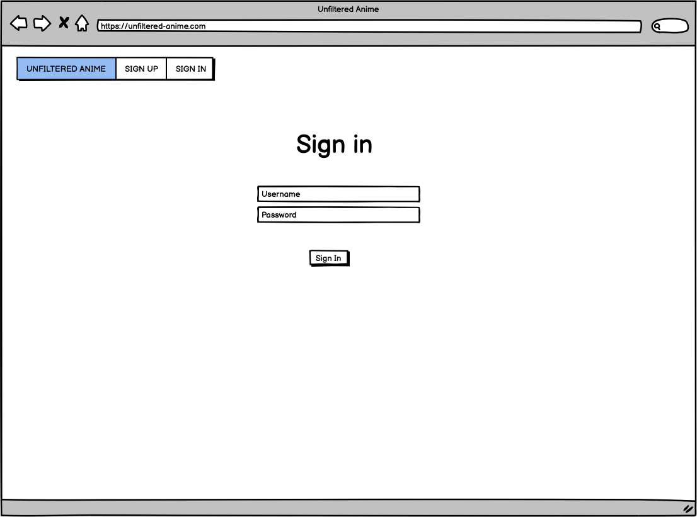

### User logged-in Home Page:
Once the user logs in the nav bar changes. Here is the view.

### Admin logged-in Home Page:
Once the admin logs in the nav bar changes. Here is the view.

### User or Admin watchList page:
This is the view for the WatchList.

### User Review detail user or non user Page:
When the user or non logged in user clicks on a post this is the detail page.

### User Review detail own post or admin Page
This is what the page would look like when admin or user is logged in.

## Existing Features

### Navbar
For anyone who comes into the site this is the default navbar. The navbar includes a sign in and sign out function.
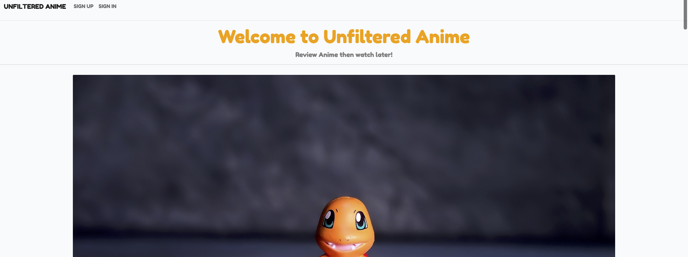

### Review detail
Here is the view when you click on a post when your not logged in.

### Sign In
Here is the sign in page.

### Sign Up
Here is the sign up page.

### Sign Out
Here is the sign out page.

### Log in Alert.
Here is what the alert looks like when you log in. 

### User Nav
Here is what the Nav bar looks like when your logged in.

### Review List
Here is the list of reviews on the home page under the navbar.

### Add Review
Here is what it looks like for a logged in user to add a review. Only logged in users can do this. This is a form for Users to fill out. 

### Watch Later List
Each review has a add to watch list button for a logged in user. This adds the review to the watch later list. There is a remove from watch later button each review. It removes the review from the watch later list. Users also are able to open the review by clicking the post too. 

### Review detail admin or user own
If an admin logs in they get the option in the review post itself to edit or delete a review. If a user is logged in then they can edit or delete their own post only.

### Upvote or Downvote
If a user is logged in then they can either upvote or downvote. They can't do both.

### Comments
Here is what the comments section looks like for any logged in user. If you comment on a post as a user it then gets sent to the admin for authorisation.

### Comments as an admin
Here is what the comments section looks like as an admin. The extra feature is that admin can delete any comment from any user as feature to make sure all comments are appropriate.

### Comment approval
Here is where the admin can approve comments. This is in the admin panel.

### Footer
The footer has been kept basic just my trademark as for who created the site.

### Login as admin
If an admin is logged in. They get access to a diffrent nav bar with access to the admin panel.

### Admin center
Here is where the admin can make any changes they would like within the admin panel.

### Favicon
Here is the Favicon used:
Image used:

Favicon live:

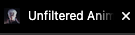

## Future Features
    1. 404 error pages
    2. Allow admin to approve comments via the Review site itself.
    3. Be able to add friends and direct message.
    4. Better account management i.e email address and profile picture.
    5. Crunchy roll Anime streaming site integration.
    6. Social Media integration
    7. Anime merchandise shop section
    8. Anime social media platform - Stories/shorts

# Technologies Used
### Technologies and Programs Used:
+ GitHub
    + Used for version control
    + Used for issue management
    + Used for Agile manage tool
    + Hosted platform for website
+ Heroku 
    + App deployment
+ ElephantSQL
    + Used as the database for project
+ Cloudinary
    + Used for static media storage
+ Balsamiq:
    + Create wireframes
+ Bootstrap:
    + Style webiste
+ Font Awesome:
    + Used for Icons
+ Google Fonts
    + Used for Fonts
+ Languages used
    + HTML5
    + CSS3
    + Javascript
    + Python
    + Django
+ Gitpod - IDE
+ Google - Research platform.
+ Add-ons:
    + Crispy Forms
    + Psycopg2 
    + Summernote
    + AllAuth

# Testing

Both Automatic ans Manual testing was done throughout this project. I felt doing Unit testing wouldn't be appropriate due to the simple project in place. Due to the lack of complexity I felt my time would be better placed elsewhere. Hence I used my Python Pep8 inbuilt add-on to ensure that my code would is valid. I then used external validators for my other code as will be shown later. I also used manual testing by continously checking what my site looks like on diffrent browsers and devices and making sure all functions work as expected.

## Functionality and Compatibility Testing
For functionality testing I tested my website in all diffrent sizes in chrome, firefox and safari.
My project looked great on all browsers and were responsive on mobile, tablet and desktop. There was room for improvement but the responsiveness was still functional.
Much testing was done using an Iphone 13 pro, iPad pro and Macbook Pro 13". This ensured I knew what impact my changes were continously making. 

## Code Validator Testing
HTML:

I used the following Html validator to validate my project. It was validated via: https://validator.w3.org/
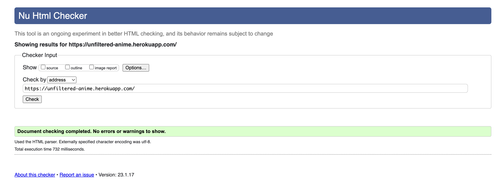

CSS:

I used the following CSS validator to validate my project. It was validated via: https://jigsaw.w3.org/css-validator/
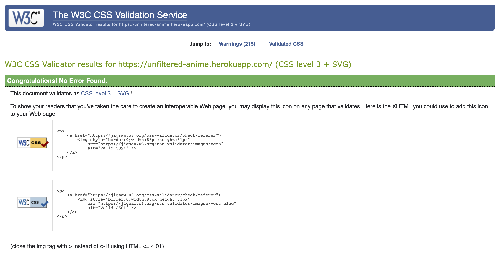

Jshint:

I used the following JS validator to validate my project. It was validated via: https://jshint.com/

Python:

Within Gitpod I used the Code Institute template to create my project. Within this template there is a PEP8 validator. All errors were fixed for each and every file. Firstly the template constructed by Code Institute have add-ons which checks that the code remains at a pep8 standard. Hence no errors are in my code apart from 3 add-on issues. The errors are known and do not effect code in anyway so can be ignored.

## SEO Testing
Below are screenshots taken from the chrome dev tools lighthouse function to evaluate SEO of the website which includes all HTML sites.

SEO Home Desktop testing result:

SEO Home Desktop testing result:

SEO Review Detail Desktop testing result:

SEO Review Detail mobile testing result:

SEO add review desktop testing result:

SEO add review mobile testing result:

SEO watchlist desktop testing result:

SEO watchlist mobile testing result:

## Manual testing

Below are the user stories and the manual testing outcomes for each:
I did manual testing throughout my project according to my user stories to make sure all requirements were met. These were tracked via Github to make sure all was processed correctly. 

1. USER STORY: View Review list:

    Action: Browse Home page.
    Expected Result: See list of Reviews.
    Actual Result: See list of Reviews.
    Same result in all browsers: Yes

2. USER STORY: Create Review

    Action: Click Add review button and fill out the create review form.
    Expected Result: Successfully create a new review.
    Actual Result: Successfully create a new review.
    Same result in all browsers: Yes

3. USER STORY: Delete Review
    
    Action: Click on review and click delete button.
    Expected Result: See delete button on own posts, then click delete to remove your own review. Can't see delete button on others posts.
    Actual Result: Can see the delete button and was able to delete own review only. Can't see delete button on others posts.
    Same result in all browsers: Yes

4. USER STORY: Edit Review
   
    Action: Click on review and click edit button.
    Expected Result: See edit button on own posts, then click edit to edit your own review. Can't see edit button on others posts.
    Actual Result: Can see the edit button and was able to edit own review only. Can't see edit button on others posts.
    Same result in all browsers: Yes

5. USER STORY: Upvote/downvote review
    
    Action: Click thumbs up icon to upvote and click thumbs down icon to downvote.
    Expected Result: Icon changes colour and number according to which you have picked.
    Actual Result: Icon changes colour and number according to which you have picked.
    Same result in all browsers: Yes

6. USER STORY: Account Registration
    
    Action: Click Sign up button then enter username and password to sign up.
    Expected Result: Be able to sign up successfully, indicatd by Navbar changing so it shows log out and add review as an option.
    Actual Result: Was able to sign up successfully, indicatd by Navbar changing so it shows log out and add review as an option.
    Same result in all browsers: Yes

7. USER STORY: Comment On Review
    
    Action: Click on review then leave a comment via the text field and submit button. 
    Expected Result: See your own comment on the review.
    Actual Result: See your own comment on the review.
    Same result in all browsers: Yes

8. USER STORY: View Comments
    
    Action: Click on a post then scroll to the bottom. 
    Expected Result: See comments
    Actual Result: Can see comments.
    Same result in all browsers: Yes

9. USER STORY: View upvote/downvotes
   
    Action: Click into post and scroll down to upvote/downvote section.
    Expected Result: See number indicator for upvote/downvotes.
    Actual Result: Can see number indicator for upvote/downvotes.
    Same result in all browsers: Yes

10. USER STORY: Site pagitnation
    
    Action: Add more then 10 reviews and click next and bottom of page to move to next page.
    Expected Result: Able to switch to next page after 10 reviews.
    Actual Result: Able to switch to next page after 10 reviews.
    Same result in all browsers: Yes

11. USER STORY: Add review to watch later
   
    Action: Click the add review button
    Expected Result: If not logged in, redirected to the sign in page. If logged in adds the review to your watch later list.
    Actual Result: If not logged in, redirected to the sign in page. If logged in adds the review to your watch later list.
    Same result in all browsers: Yes

12. USER STORY: Watch later section view
   
    Action: Log in, click watch later in nav bar. 
    Expected Result: See reviews added to watch later page. 
    Actual Result: Can see watch later list
    Same result in all browsers: Yes

13. USER STORY: Manage Reviews
    
    Action: Login as admin user. Click on posts to edit/delete any review or go to admin panel to do this via the link in nav bar.
    Expected Result: Successfully be able to edit/delete review via website or via admin panel.
    Actual Result: Successfully able to edit/delete review via website or via admin panel.
    Same result in all browsers: Yes

14. USER STORY: Manage comments

    
    Action: Login as admin user. Click on posts to edit/delete any comment or go to admin panel to do this via the link in nav bar. Approve comments for other users.
    Expected Result: Successfully be able to delete comments via website or via admin panel. Approve comments or edit comments via admin panel.
    Actual Result: Successfully be able to delete comments via website or via admin panel. Approve comments or edit comments via admin panel.
    Same result in all browsers: Yes

15. User Story: 404 error
    
    Action: Change the url to have an incorrect path
    Expected Result: Get a 404 error page which allows you to get to to correct site.
    Actual Result: No 404 error page instead I get a default page which has no links to go to correct site.
    Same result in all browsers: Yes

# Bugs
## Fixed Bugs

1. Issue: paragraph tags showing around description on Review list.

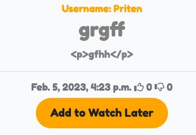
    
Fix: change line from {{ review.description }} to {{ review.description | safe }}

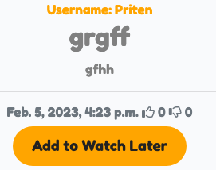

2. Issue: When leaving a comment user get's no alert to say the comment has been sent for authorisation.
    
Fix: Add alert code to the views.py for comments.
Before:

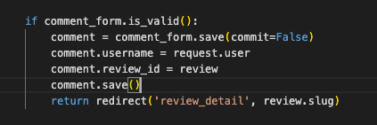

After:

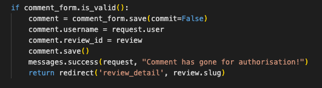

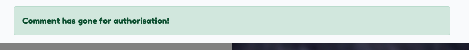

3. Delete Review button spacing bug

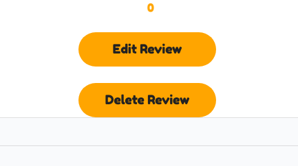
    
Fix: Add break after delete review button
Code before:

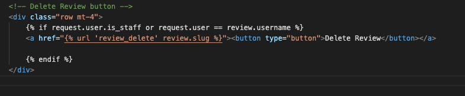

Code after: 

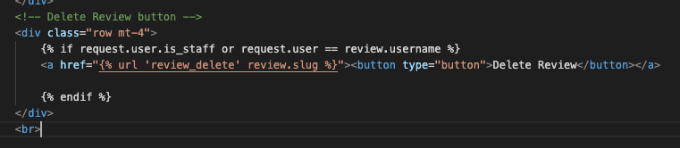

Outcome:

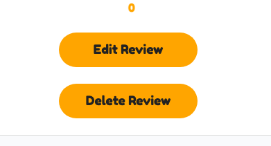

## Unfixed Bugs

Due to time constrains we were unable to fix these following bugs:

1. Issue: When adding or editing  reviews the draft function looses the post as a end user.
Potential fix: Add a draft section in navbar where all drafts are saved.

2. Issue: In mobile mode when adding or editing reviews the summernote text field isn't responsive.
Potential fix: Would need more research. 

3. Issue: Downvotes button allignment is slightly higher then upvotes.
Potential fix: Would need more research.

4. Issue: No 404 error page
Potential fix: Add 404 error page and add to URL.py.

# Deployment

## Deployment of Project:
Github:
1. Go to Code Insitite Template [CI template](https://github.com/Code-Institute-Org/gitpod-full-template)
2. Click use this template
3. Click Create new Repository
4. Name accordingly

Heroku/Elephant SQL
1. Login or Sign up to Heroku
2. Create new app
3. Name accordingly
4. Create Database in ElephantSQL:
    1. Sign up or Login
    2. Create new instance
    3. Give your plan a Name (this is commonly the name of the project), Select the Tiny Turtle (Free) plan, You can leave the Tags field blank
    4. Select region nearest to you
    5. Review and click create instance
    6. Open your new instance and grab your URL for use.
5. Create env.py in Django project with Database URL and setup a secret key. The code looks like this:
    import os
    os.environ["DATABASE_URL"]="<copiedURL>"
    os.environ["SECRET_KEY"]="my_super^secret@key"
6. Make sure it's added to your gitignore
7. Modify settings.py by adding:
    import os
    import dj_database_url
    if os.path.isfile('env.py'):
        import env
8. Lower down in settings.py add:
    SECRET_KEY = os.environ.get('SECRET_KEY')
9. Hook up your database by commenting account old database code and adding new:
    Comment out this:
     DATABASES = {
         'default': {
            'ENGINE': 'django.db.backends.sqlite3',
            'NAME': BASE_DIR / 'db.sqlite3',
        }
    }
    
    Add this:
    DATABASES = {
        'default': dj_database_url.parse(os.environ.get("DATABASE_URL"))
    }

10. Run python manage.py migrate
11. Push project to Github
12. In your Heroku go to your app
13. Go to settings
14. Config vars
15. Add your DATABASE_URL and SECRET_KEY and PORT as 8000.
16. Create Storage via Cloudinary:
    1. Create Cloudinary account
    2. Copy API Environment variable
    3. Add follwing to env.py:
        os.environ["CLOUDINARY_URL] = Add environment variable here
    4. Add same details into Heroku Config Vars to match.
    5. Add DISABLE_COLLECTSTATIC to 0 in Heroku Config Vars too.(removed at the end)
    6. Add following Cloudinary apps to  installed apps in settings.py:
            INSTALLED_APPS = [
                'django.contrib.admin',
                'django.contrib.auth',
                'django.contrib.contenttypes',
                'django.contrib.sessions',
                'django.contrib.messages',
                'django.contrib.sites',
                'cloudinary_storage',
                'django.contrib.staticfiles',
                'cloudinary',
            ]
    7. Towards the end of settings.py add:

        STATICFILES_STORAGE = 'cloudinary_storage.storage.'\
                      'StaticHashedCloudinaryStorage'
        STATICFILES_DIRS = [os.path.join(BASE_DIR, 'static')]
        STATIC_ROOT = os.path.join(BASE_DIR, 'staticfiles')

        MEDIA_URL = '/media/'
        DEFAULT_FILE_STORAGE = 'cloudinary_storage.storage.MediaCloudinaryStorage'

17. Add template files accordingly in settings.py:
            TEMPLATES_DIR = os.path.join(BASE_DIR, 'templates')
18. Under Templates in the settings.py file change 'DIRS' to reflect templates:
        'DIRS': [TEMPLATES_DIR],
19. Add Heroku Allowed hosts in settings.py:
        ALLOWED_HOSTS = ['unfiltered-anime.herokuapp.com', 'localhost']
20. create media, static and templates folders in root of project. 
21. Create Procfie with:
        web: gunicorn unfiltered_anime.wsgi
22. Deploy to Github.
23. Back into Heroku go back into your app and click deploy then for deployment method link to your Github.
24. Search for repo name and connect
25. Deploy branch and enable automatic deployment.

Once your finish your project make sure you do the following:
Remove DISABLE_COLLECTSTATIC from Heroku VARS.
In your settings.py turn off debugging. 

# References
1. Template Used as respository: [CI template](https://github.com/Code-Institute-Org/gitpod-full-template)
2. Fonts used were from Google Fonts: [Google Fonts](https://fonts.google.com/)
3. Icons were taken from Font Awesone: [Font Awesome](https://fontawesome.com/)
4. Inspiration for structures, models, views and URLS were taken from the "I think therefore I Blog" project walkthrough: [I think there I blog Walkthrogh](https://github.com/Code-Institute-Solutions/Django3blog/tree/master/11_messages)
5. Much of Project help was taken from Django Central such as issues linking URL, Models and views: [Django Central Articles](https://djangocentral.com/articles/)
6. For General help through out my project teh offical Django documentation was great help: [Django](https://docs.djangoproject.com/)
7. Bootstrap was used for design and structure of UI: [Bootstrap](https://getbootstrap.com/)
8. Button design was fro I used "Buy me a coffee": [Copy & Paste CSS] (https://copy-paste-css.com/)
9. Placeholder images are taken from: [Pixabay](https://pixabay.com/)
10. Deployment was on Heroku: [Heroku](https://heroku.com/)
11. Static media storage: [Cloudinary](https://cloudinary.com/)
12. Database: [ElephantSQL](https://elephantsql.com)
13. HTML template used for Blog: [Clean Blog](https://startbootstrap.com/theme/clean-blog)
14. Extended text fields for Bootstrap: [Summernote](https://summernote.org/)
15. Django Authentication source: [Django-allauth](https://django-allauth.readthedocs.io/en/latest/)
16. Django general help: [Mozilla Developers](https://developer.mozilla.org/)
17. Wireframe: [Balsamiq](https://balsamiq.com/)
18. Models diagram: [LucidChart](https://www.lucidchart.com/)
19. Favicon Generator: [Favicon Generator](https://favicon.io/favicon-converter/)
20. General help taken for HTML, CSS, JS, Python and django: [W3schools](https://www.w3schools.com/)
21. General project help was also taken from Reddit: [Reddit](https://www.reddit.com/)
22. General project help was also taken from Stackoverflow: [StackOverflow](https://stackoverflow.com/)
23. Help with watch list article: [Article for Watchlist 1](https://stackoverflow.com/questions/63403309/watchlist-system-on-django) , [Article for Watchlist 2](https://forum.djangoproject.com/t/adding-watchlist-watchlist-not-displaying-added-items/12411)

# Acknowledgements
1. Much help was taken from Tutors at Code Institute.
2. Much help and inspirtation was taken from Code Insitute course materials.
3. Much help was taken from Code Institute Slack channels. 